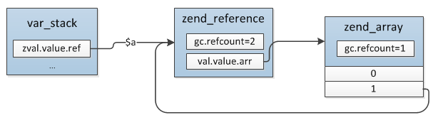
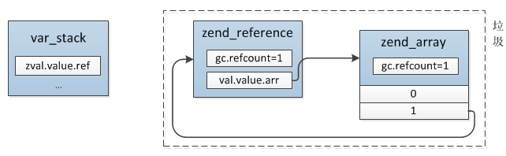

# 图解PHP的GC算法

php的垃圾回收分两种，一种是自动GC，另一种就是通过垃圾回收机制来回收

## 自动GC

当 `zval` 断开 `value` 指向的时候如果发现 `refcount=0` ,发生断开的两种常见情况为修改变量与函数返回

- 修改变量：会断开原有 `value` 的指向
- 函数返回：释放所有的局部变量，也就是所有局部变量的引用计数减一

`unset` 也能主动销毁一个变量

## 垃圾回收机制

由于自动GC在循环引用的情况下无法释放内存，所以引入了垃圾回收机制

### 什么是循环引用

循环引用就是变量的内部成员引用了变量自身

```php
$a = [1];
$a[] = &$a;
unset($a);
```

`unset($a)` 之前引用关系如下图，变量 `a` 的类型为引用，该引用的 `refcount = 2`，一个来自 `$a`,另一个来自 `$a[1]`



`unset($a)` 之后，减少了一次该引用的 `refcount`，此时已经没有任何外部引用了，但是数组中仍然有一个元素指向该引用



### 垃圾收集器会收集哪些变量

这种因为循环引用而导致的无法释放的变量就称为垃圾，垃圾收集器通过 `zval.u1.type_flag` 来判断是否要收集，如果是 `IS_TYPE_COLLECTABLE` 标识的变量类型才收集

```c
/* zval.u1.v.type_flags   zend_types.h */
#define IS_TYPE_CONSTANT			(1<<0)  // 常量类型
#define IS_TYPE_IMMUTABLE			(1<<1)  // 不可变的类型， 比如存在共享内存的数组
#define IS_TYPE_REFCOUNTED			(1<<2)  // 需要引用计数的类型
#define IS_TYPE_COLLECTABLE			(1<<3) // 可能包含循环引用的类型(IS_ARRAY, IS_OBJECT)
#define IS_TYPE_COPYABLE			(1<<4) // 可被复制的类型,不包含对象和资源
```

### 垃圾收集器什么时候开始收集

当 `refcount` 减少的时候，垃圾收集器都会试图收集垃圾，如果已经发现收集过了就不会重复收集

```
$a = [];
$b = $a;
$c = $a;
unset($b);  // 触发收集
unset($c);  // 触发收集
```

### 垃圾回收算法

垃圾收集器的数据结构

```c
typedef struct _zend_gc_globals {
    // 是否启用GC
	zend_bool         gc_enabled;
    // 是否在垃圾检查过程中
	zend_bool         gc_active;
    // 缓冲区是否已满
	zend_bool         gc_full;
    // 预先分配的缓冲区数组
	gc_root_buffer   *buf;				/* preallocated arrays of buffers   */
    // 指向缓冲区中最新加入的可能是垃圾的元素
	gc_root_buffer    roots;			/* list of possible roots of cycles */
    // 指向未使用的缓冲区列表,与 first_unused 类似，用来管理buf中开始加入后来又删除的节点，是一个单链表
	gc_root_buffer   *unused;			/* list of unused buffers           */
    // 指向第一个未使用的缓冲区,从未使用过的第一个，用过被删除的由 unused 来管理
	gc_root_buffer   *first_unused;		/* pointer to first unused buffer   */
    // 指向最后一个未使用的缓冲区
	gc_root_buffer   *last_unused;		/* pointer to last unused buffer    */
    // 待释放垃圾的列表
	gc_root_buffer    to_free;			/* list to free                     */
    // 下一个待释放垃圾的列表
	gc_root_buffer   *next_to_free;
    // 统计GC运行次数,缓冲区满了，才会运行GC算法
	uint32_t gc_runs;
    // 统计已回收的垃圾数
	uint32_t collected;

#if GC_BENCH
	uint32_t root_buf_length;
	uint32_t root_buf_peak;
	uint32_t zval_possible_root;
	uint32_t zval_buffered;
	uint32_t zval_remove_from_buffer;
	uint32_t zval_marked_grey;
#endif

	gc_additional_buffer *additional_buffer;

} zend_gc_globals;
```

有一个全局变量 `gc_globals` 的 `HashTable`, 可以通过 `GC_C(v)` 来获取值

回收过程：
1. 从 `buffer` 链表的 `roots` 开始遍历，把当前 `value` 标为灰色(`zend_refcounted_h.gc_info` 置为 `GC_GREY`)，然后对当前 `value` 的成员进行深度优先遍历，把成员 `value` 的 `refcount` 减1，并且也标为灰色；

2. 重复遍历 `buffer` 链表，检查当前 `value` 引用是否为0，为0则表示确实是垃圾，把它标为白色(GC_WHITE)，如果不为0则排除了引用全部来自自身成员的可能，表示还有外部的引用，并不是垃圾，这时候因为步骤1对成员进行了 `refcount` 减1操作，需要再还原回去，对所有成员进行深度遍历，把成员 `refcount` 加1，同时标为黑色；

3. 再次遍历 `buffer` 链表，将非 `GC_WHITE` 的节点从 `roots` 链表中删除，最终 `roots` 链表中全部为真正的垃圾，最后将这些垃圾清除。

### gc初始化

在解析 `php.ini` 文件的 `enable_gc` 参数之后，会触发 `OnUpdateGCEnabled` 函数，调用 `gc_init()` 来初始化垃圾回收器

```c
// Zend/zend.c

ZEND_INI_BEGIN()
	...
	STD_ZEND_INI_BOOLEAN("zend.enable_gc","1",ZEND_INI_ALL,OnUpdateGCEnabled,gc_enabled,zend_gc_globals,gc_globals)
 	...
#endif
ZEND_INI_END()

static ZEND_INI_MH(OnUpdateGCEnabled) /* {{{ */
{
	OnUpdateBool(entry, new_value, mh_arg1, mh_arg2, mh_arg3, stage);

	if (GC_G(gc_enabled)) {
		gc_init();
	}

	return SUCCESS;
}
/* }}} */

ZEND_API void gc_init(void)
{
	if (GC_G(buf) == NULL && GC_G(gc_enabled)) {
        // 分配buf缓存区内存，大小为 GC_ROOT_BUFFER_MAX_ENTRIES（10001）,其中第一个保留不被使用
		GC_G(buf) = (gc_root_buffer*) malloc(sizeof(gc_root_buffer) * GC_ROOT_BUFFER_MAX_ENTRIES);
		GC_G(last_unused) = &GC_G(buf)[GC_ROOT_BUFFER_MAX_ENTRIES];
        // 进行 GC_G 的初始化，其中：GC_G(first_unused) = GC_G(buf)+1;从第二个开始，第一个保留
		gc_reset();
	}
}
```

销毁一个变量的时候就会调用 `i_zval_ptr_dtor()` 来判断是否需要加入垃圾收集器

```c
// Zend/zend_variables.h
static zend_always_inline void i_zval_ptr_dtor(zval *zval_ptr ZEND_FILE_LINE_DC)
{
    // 判断是否需要引用计数类型，如果不是，则跳过
	if (Z_REFCOUNTED_P(zval_ptr)) {
        // refcount 减一
		if (!Z_DELREF_P(zval_ptr)) {
            // refcount 减一后变为0，不是垃圾，正常回收
			_zval_dtor_func(Z_COUNTED_P(zval_ptr) ZEND_FILE_LINE_RELAY_CC);
		} else {
            // refcount 减一后扔然大于0
			GC_ZVAL_CHECK_POSSIBLE_ROOT(zval_ptr);
		}
	}
}
```

进行垃圾收集

```c
// Zend/zend_gc.h
#define GC_ZVAL_CHECK_POSSIBLE_ROOT(z) \
	gc_check_possible_root((z))

static zend_always_inline void gc_check_possible_root(zval *z)
{
	ZVAL_DEREF(z);
    // 判断是否是可收集以及是否已经收集过
	if (Z_COLLECTABLE_P(z) && UNEXPECTED(!Z_GC_INFO_P(z))) {
		gc_possible_root(Z_COUNTED_P(z));
	}
}
```

判断是否已经收集过，是通过 `zend_refcounted_h.u.gc_info` 来判断的，第一次收集后，会把这个值设置为 `GC_PURPLE`,收集时首先会从 `buf` 找那个选择一个空闲节点，然后将 `value` 的 `gc` 保存到这个节点中，如果没有空闲节点则说明回收期已经满了，这时则会触发垃圾鉴定、回收的程序

```c
// Zend/zend_gc.c
ZEND_API void ZEND_FASTCALL gc_possible_root(zend_refcounted *ref)
{
	gc_root_buffer *newRoot;

	if (UNEXPECTED(CG(unclean_shutdown)) || UNEXPECTED(GC_G(gc_active))) {
		return;
	}
    // 插入的节点必须是 数组或者对象
	ZEND_ASSERT(GC_TYPE(ref) == IS_ARRAY || GC_TYPE(ref) == IS_OBJECT);
    // 插入的节点颜色必须是 GC_BLACK，防止重复插入
	ZEND_ASSERT(EXPECTED(GC_REF_GET_COLOR(ref) == GC_BLACK));
	ZEND_ASSERT(!GC_ADDRESS(GC_INFO(ref)));

	GC_BENCH_INC(zval_possible_root);
    // 先看下 unused 中有没有可用的
	newRoot = GC_G(unused);
	if (newRoot) {
        // 有的话先用 unused 的，然后将 GC_G(unused) 指向单链表的下一个
		GC_G(unused) = newRoot->prev;
	} else if (GC_G(first_unused) != GC_G(last_unused)) {
        // 没有 unused 的话，看下 first_unused 是否还有没有用的
		newRoot = GC_G(first_unused);
		GC_G(first_unused)++;
	} else {
        // 缓冲区已满，启用垃圾鉴定回收程序
		if (!GC_G(gc_enabled)) {
			return;
		}
		GC_REFCOUNT(ref)++;
		gc_collect_cycles();
		GC_REFCOUNT(ref)--;
		if (UNEXPECTED(GC_REFCOUNT(ref)) == 0) {
			zval_dtor_func(ref);
			return;
		}
		if (UNEXPECTED(GC_INFO(ref))) {
			return;
		}
		newRoot = GC_G(unused);
		if (!newRoot) {
#if ZEND_GC_DEBUG
			if (!GC_G(gc_full)) {
				fprintf(stderr, "GC: no space to record new root candidate\n");
				GC_G(gc_full) = 1;
			}
#endif
			return;
		}
		GC_G(unused) = newRoot->prev;
	}
    // 这里是用做调试用
	GC_TRACE_SET_COLOR(ref, GC_PURPLE);
    // 将该节点在 bug 数组中的位置保存到了 gc_info 中，这样的目的是当后续 value 的 refcount 变为0，需要将其从 buf 中删除时可以知道该 value 保存在哪个 gc_root_buffer 中
	GC_INFO(ref) = (newRoot - GC_G(buf)) | GC_PURPLE;
	newRoot->ref = ref;
    // 插入 roots 链表头部
	newRoot->next = GC_G(roots).next;
	newRoot->prev = &GC_G(roots);
	GC_G(roots).next->prev = newRoot;
	GC_G(roots).next = newRoot;

	GC_BENCH_INC(zval_buffered);
	GC_BENCH_INC(root_buf_length);
	GC_BENCH_PEAK(root_buf_peak, root_buf_length);
}
```

把 value 从 buf 中删除的操作通过 `GC_REMOVE_FROM_BUFFER()` 宏完成

```c
// Zend/zend_gc.c
#define GC_REMOVE_FROM_BUFFER(p) do { \
		zend_refcounted *_p = (zend_refcounted*)(p); \
		if (GC_ADDRESS(GC_INFO(_p))) { \
			gc_remove_from_buffer(_p); \
		} \
	} while (0)

#define GC_ADDRESS(v) \
	((v) & ~GC_COLOR)
```

删除时首先根据 gc_info 取到 gc_root_buffer,然后再从 buf 中移除，删除后把空出来的 gc_root_buffer 插入 unused 单链表尾部

```c
ZEND_API void ZEND_FASTCALL gc_remove_from_buffer(zend_refcounted *ref)
{
	gc_root_buffer *root;

	ZEND_ASSERT(GC_ADDRESS(GC_INFO(ref)));

	GC_BENCH_INC(zval_remove_from_buffer);
    // GC_ADDRESS 就是获取节点在缓存区的位置，因为删除是根据 zend_refcounted,而缓存链表的节点类型是 gc_root_buffer  
	if (EXPECTED(GC_ADDRESS(GC_INFO(ref)) < GC_ROOT_BUFFER_MAX_ENTRIES)) {
		root = GC_G(buf) + GC_ADDRESS(GC_INFO(ref));
		gc_remove_from_roots(root);
	} else {
		root = gc_find_additional_buffer(ref);
		gc_remove_from_additional_roots(root);
	}
	if (GC_REF_GET_COLOR(ref) != GC_BLACK) {
		GC_TRACE_SET_COLOR(ref, GC_PURPLE);
	}
	GC_INFO(ref) = 0;

	/* updete next root that is going to be freed */
	if (GC_G(next_to_free) == root) {
		GC_G(next_to_free) = root->next;
	}
}
```

当 buf 满了会执行垃圾回收机制

```c
ZEND_API int zend_gc_collect_cycles(void)
{
	int count = 0;

	if (GC_G(roots).next != &GC_G(roots)) {
		gc_root_buffer *current, *next, *orig_next_to_free;
		zend_refcounted *p;
		gc_root_buffer to_free;
		uint32_t gc_flags = 0;
		gc_additional_buffer *additional_buffer_snapshot;
#if ZEND_GC_DEBUG
		zend_bool orig_gc_full;
#endif

		if (GC_G(gc_active)) {
			return 0;
		}

		GC_TRACE("Collecting cycles");
		GC_G(gc_runs)++;
		GC_G(gc_active) = 1;

		GC_TRACE("Marking roots");
        // 遍历 roots 链表，对当前节点 value 的所有成员（如数组元素、成员属性）进行深度优先遍历，把成员 refcount 减一
		gc_mark_roots();
		GC_TRACE("Scanning roots");
        // 再次遍历 roots 链表，检查各节点当前 refcount 是否为0，是的话标为白色，标识是垃圾，不是的话需要还原第一步操作，把 refcount 加回去
		gc_scan_roots();

#if ZEND_GC_DEBUG
		orig_gc_full = GC_G(gc_full);
		GC_G(gc_full) = 0;
#endif

		GC_TRACE("Collecting roots");
		additional_buffer_snapshot = GC_G(additional_buffer);
        // 将 roots 链表中的非白色节点删除，之后 roots 链表中全部是真正的垃圾，将垃圾链表转到 to_free 等待释放
		count = gc_collect_roots(&gc_flags);
#if ZEND_GC_DEBUG
		GC_G(gc_full) = orig_gc_full;
#endif
		GC_G(gc_active) = 0;

		if (GC_G(to_free).next == &GC_G(to_free)) {
			/* nothing to free */
			GC_TRACE("Nothing to free");
			return 0;
		}

		/* Copy global to_free list into local list */
		to_free.next = GC_G(to_free).next;
		to_free.prev = GC_G(to_free).prev;
		to_free.next->prev = &to_free;
		to_free.prev->next = &to_free;

		/* Free global list */
		GC_G(to_free).next = &GC_G(to_free);
		GC_G(to_free).prev = &GC_G(to_free);

		orig_next_to_free = GC_G(next_to_free);

#if ZEND_GC_DEBUG
		orig_gc_full = GC_G(gc_full);
		GC_G(gc_full) = 0;
#endif

		if (gc_flags & GC_HAS_DESTRUCTORS) {
			GC_TRACE("Calling destructors");
			if (EG(objects_store).object_buckets) {
				/* Remember reference counters before calling destructors */
                // 释放垃圾
				current = to_free.next;
				while (current != &to_free) {
					current->refcount = GC_REFCOUNT(current->ref);
					current = current->next;
				}

				/* Call destructors */
				current = to_free.next;
				while (current != &to_free) {
					p = current->ref;
					GC_G(next_to_free) = current->next;
					if (GC_TYPE(p) == IS_OBJECT) {
						zend_object *obj = (zend_object*)p;

						if (IS_OBJ_VALID(EG(objects_store).object_buckets[obj->handle]) &&
							!(GC_FLAGS(obj) & IS_OBJ_DESTRUCTOR_CALLED)) {
							GC_TRACE_REF(obj, "calling destructor");
							GC_FLAGS(obj) |= IS_OBJ_DESTRUCTOR_CALLED;
							if (obj->handlers->dtor_obj) {
								GC_REFCOUNT(obj)++;
								obj->handlers->dtor_obj(obj);
								GC_REFCOUNT(obj)--;
							}
						}
					}
					current = GC_G(next_to_free);
				}

				/* Remove values captured in destructors */
				current = to_free.next;
				while (current != &to_free) {
					GC_G(next_to_free) = current->next;
					if (GC_REFCOUNT(current->ref) > current->refcount) {
						gc_remove_nested_data_from_buffer(current->ref, current);
					}
					current = GC_G(next_to_free);
				}
			}
		}

		/* Destroy zvals */
		GC_TRACE("Destroying zvals");
		GC_G(gc_active) = 1;
		current = to_free.next;
		while (current != &to_free) {
			p = current->ref;
			GC_G(next_to_free) = current->next;
			GC_TRACE_REF(p, "destroying");
			if (GC_TYPE(p) == IS_OBJECT) {
				zend_object *obj = (zend_object*)p;

				if (EG(objects_store).object_buckets &&
				    IS_OBJ_VALID(EG(objects_store).object_buckets[obj->handle])) {
					EG(objects_store).object_buckets[obj->handle] = SET_OBJ_INVALID(obj);
					GC_TYPE(obj) = IS_NULL;
					if (!(GC_FLAGS(obj) & IS_OBJ_FREE_CALLED)) {
						GC_FLAGS(obj) |= IS_OBJ_FREE_CALLED;
						if (obj->handlers->free_obj) {
							GC_REFCOUNT(obj)++;
                            // 调用 free_obj 释放对象
							obj->handlers->free_obj(obj);
							GC_REFCOUNT(obj)--;
						}
					}
					SET_OBJ_BUCKET_NUMBER(EG(objects_store).object_buckets[obj->handle], EG(objects_store).free_list_head);
					EG(objects_store).free_list_head = obj->handle;
					p = current->ref = (zend_refcounted*)(((char*)obj) - obj->handlers->offset);
				}
			} else if (GC_TYPE(p) == IS_ARRAY) {
                // 释放数组
				zend_array *arr = (zend_array*)p;

				GC_TYPE(arr) = IS_NULL;
				zend_hash_destroy(arr);
			}
			current = GC_G(next_to_free);
		}

		/* Free objects */
		current = to_free.next;
		while (current != &to_free) {
			next = current->next;
			p = current->ref;
			if (EXPECTED(current >= GC_G(buf) && current < GC_G(buf) + GC_ROOT_BUFFER_MAX_ENTRIES)) {
				current->prev = GC_G(unused);
				GC_G(unused) = current;
			}
			efree(p);
			current = next;
		}

		while (GC_G(additional_buffer) != additional_buffer_snapshot) {
			gc_additional_buffer *next = GC_G(additional_buffer)->next;
			efree(GC_G(additional_buffer));
			GC_G(additional_buffer) = next;
		}

		GC_TRACE("Collection finished");
		GC_G(collected) += count;
		GC_G(next_to_free) = orig_next_to_free;
#if ZEND_GC_DEBUG
		GC_G(gc_full) = orig_gc_full;
#endif
		GC_G(gc_active) = 0;
	}

	return count;
}
```


# 参考

[php7内核剖析](https://github.com/pangudashu/php7-internal)


