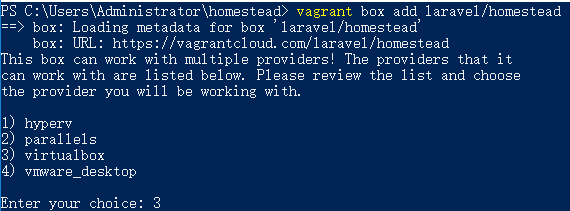
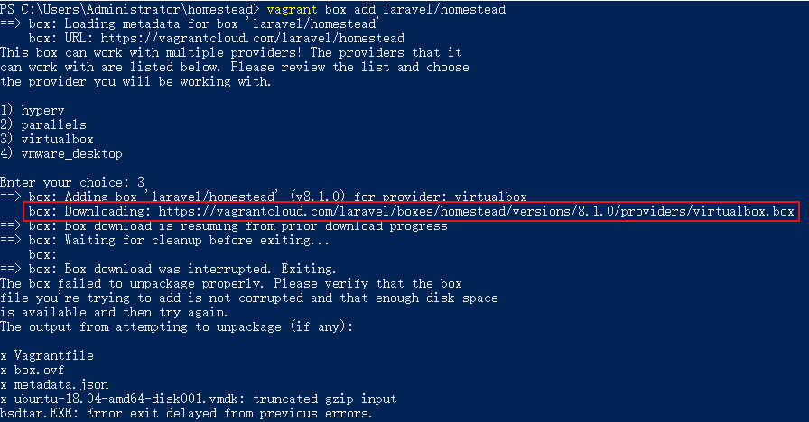
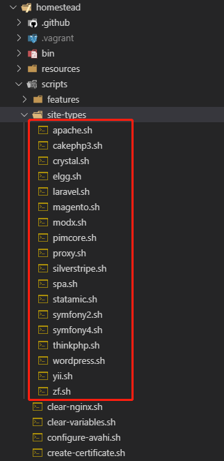

# 安装Homestead

## 下载 virtualBox

[下载地址](https://www.virtualbox.org/wiki/Downloads)

## 下载 vagrant

[下载地址](https://www.vagrantup.com/downloads.html)

## 下载 vagrant 的 laravel/homestead box

下载最新版本

```bash
vagrant box add laravel/homestead
```

指定 box 版本

```bash
vagrant box add laravel/homestead --box-version=7.1.0
```

这里选择 3 virtualbox



国内这样直接下载会很慢，我们可以把下载连接取出来，使用迅雷等下载工具会快一些

输入下载命令后，按住 `Ctrl + c` 中断下载，可以看到下载连接 `https://vagrantcloud.com/laravel/boxes/homestead/versions/8.1.0/providers/virtualbox.box`



下载完 `box` 后，我们就导入到 `vagrant` 中

```
vagrant box add laravel/homestead virtualbox.box
```

此时在 `C:\Users\Administrator\.vagrant.d\boxes` 下面会出现一个 `laravel-VAGRANTSLASH-homestead` 文件夹，里面有个 `0` 的文件夹，此时需要把这个文件夹名称改成你下载的 `box` 的版本号,比如现在版本是 `8.1.0`,那么就把文件名改成 `8.1.0`

新增一个文件 `metadata_url`,文件内容为 `https://app.terraform.io/laravel/boxes/homestead`

## 下载 Homestead

```
cd ~
git clone https://github.com/laravel/homestead.git homestead
cd homestead
git checkout release
init.bat
```

### 配置 Homestead 

设置 Provider

`Homestead.yml` 文件中的 `provider` 表示使用哪个 `vagrant` 提供者：`virtualbox`、`vmware_fushion`、`vmware_workstation`、`parallels`、`hyperv`等。我们一般用 `virtualbox` 就好

```
provider: virtualbox
```

配置共享文件夹

`Homestead.yml` 文件中的 `folders` 属性列出了所有主机和 `Homestead` 虚拟机共享的文件夹，这些目录会同步本地和虚拟机的文件，可以配置多个共享文件夹

```
folders:
    - map: F:\code\hqc
      to: /var/www/hqc
```

> 注：`map` 表示宿主机项目目录，`to` 表示映射到的虚拟机的项目目录

配置 `Nginx` 站点

`sites` 配置可以配置站点映射到文件夹

```
sites:
    - map: www.hqc.com
      to: /var/www/hqc/public
```
这里默认配置的是适合 `laravel` 的配置，如果你用的是其他框架，`nginx` 配置不一致，`homestead` 也跟你预留了一些常用框架的配置文件，在 `scripts/site-types` 目录中



比如我们之前有个项目用的是 `thinkphp` 框架，我们直接在 `sites` 配置项中加一个 `type` 参数 `thinkphp`

```
sites:
    - map: www.hqc.com
      to: /var/www/hqc/public
      type: thinkphp
```

也可以自己自定义配置项，只需要在 `site-types` 目录下面加一个 `xxx.sh` 文件，按照他的格式自定义下，然后在 `sites` 配置项加一个 `type` 即可

> 注：这里修改了配置需要重启下 `vagrant` 才会生效 `vagrant reload --provision`

配置 hosts

修改 `hosts` 文件，将我们 `Homestead.yaml` 文件中配置的域名映射到我们的网站

```
192.168.10.10 www.xxx.com
```

在 `homestead` 根目录中启动 `vagrant`

```
cd ~/homestead
vagrant up
vagrant ssh
```

# 连接MySQL

在项目中使用MySQL，默认的配置是：
```
ip: 127.0.0.1
host: 3306
user: homestead
password: secret
```

如果是使用 navicat 等软件，默认的配置是：
```
ip: 192.168.10.1  // homestead.yaml 里面配置的ip（192.168.10.10）,但是windows 上面连接要最后一位不用 (原因未知)
host: 33060
user: homestead
password: secret
```
