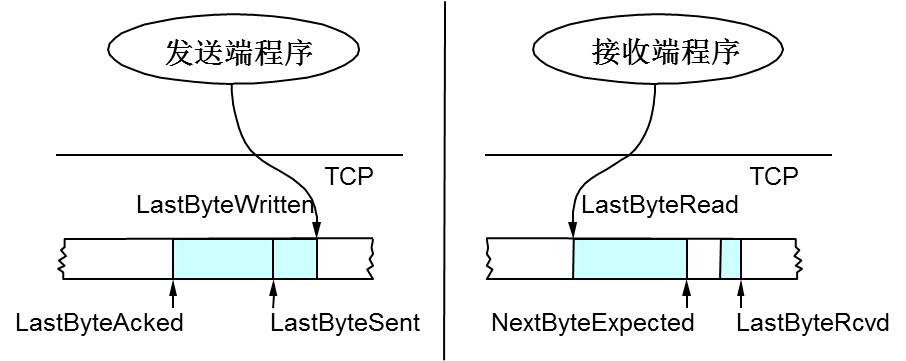

# 网络基础知识

OSI七层模型
- 物理层
- 数据链路层
- 网络层  IP协议
- 传输层  TCP协议
- 会话层  TLS/SSL
- 表示层
- 应用层

TCP/IP概念层模型
- 链路层
- 网络层
- 传输层
- 应用层

## TCP的三次握手

TCP报文头

syn flood攻击 原因？防范措施？

## TCP的四次挥手

为什么会有 time_wait 状态？
服务器出现大量 close_wait 状态的原因

## TCP和UDP的区别

- 面向非连接
- 可靠性
- 有序性
- 速度
- 量级

## TCP的滑动窗口

RTT：发送一个数据包到收到对应的ACK，所花费的时间

RTO：重传时间间隔，根据 RTT 计算得出

TCP使用滑动窗口做流量控制和乱序重排
- 保证TCP的可靠性
- 保证TCP的流控特性

窗口数据的计算过程

发送端：
- LastByteAcked: 已经收到ack的位置
- LastByteSend: 正在发送的位置
- LastByteWritten: 上层应用可写入的位置
- LastByteAcked ~ LastByteSend之间: 表示已经发送但未收到ACK的数据
- LastByteSend ~ LastByteWritten之间: 表示未发送出去的数据

接受端：
- LastByteRead: 上层应用已经读完的位置
- NextByteExpected: 收到的连续包的最后一个位置，还没有发送ACK
- LastByteRcvd: 收到的包的最后一个位置
- LastByteRead ~ NextByteExpected之间: 已收到的数据
- NextByteExpected ~ LastByteRcvd之间: 未到达的数据

接收端回复：
ACK中汇报自己的窗口大小(AdvertisedWindow) = MaxRcvBuffer - (LastByteRcvd - LastByteRead)

发送端还能发送多少数据(EffectiveWindow) = AdvertisedWindow - (LastByteSend - LastByteAcked)

## HTTP简介

超文本传输协议HTTP主要特点：
- 支持客户/服务器模式
- 简单快速
- 灵活
- 无连接
- 无状态

HTTP请求的报文结构

请求方法 URL 协议版本 回车+换行    // 请求行
头部字段名：头部字段值 回车+换行    // 请求头部  多行组成
回车+换行
消息主体                          // 请求正文

HTTP响应的报文结构

协议版本 状态码 状态码描述 回车+换行    // 响应行
头部字段名：头部字段值  回车+换行       // 响应头部
回车+换行
消息主体                            // 响应正文

在浏览器地址栏键入url，按下回车之后经历的流程
- DNS解析 浏览器缓存 系统缓存 路由缓存 
- TCP连接
- 发送HTTP请求
- 服务器处理请求并返回HTTP报文
- 浏览器解析渲染页面
- 连接结束

HTTP状态码

200 OK
400 Bad Request
401 Unauthorized
403 Forbidden
404 Not Found
499     出现大量499的原因？
500 Internal Server Error
503 Server Unavailable
504

GET请求和POST请求的区别
- HTTP报文层面: GET将请求信息放在URL，POST放在报文体
- 数据库层面：GET符合幂等性和安全性，POST不符合
- 其他层面：GET可以被缓存、被存储，而POST不行

Cookie和Session的区别

HTTP和HTTPS的区别

加密的方式
- 对称加密
- 非对称加密
- 哈希算法
- 数字签名

HSTS：强制客户端使用 HTTPS 与服务器创建连接

## Socket

